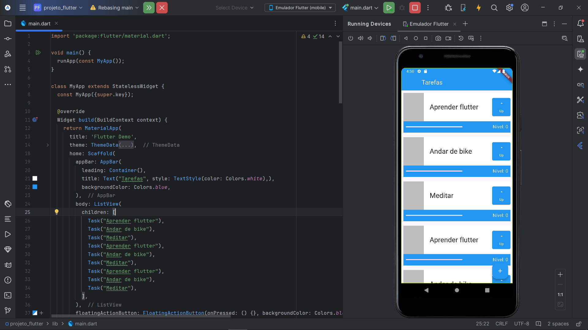
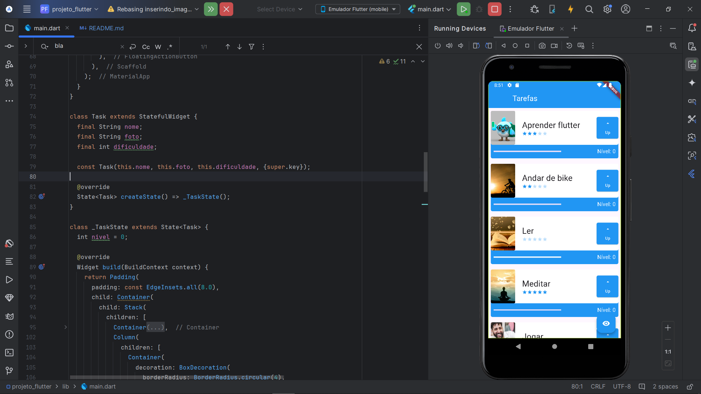

# Atividade referente a Sprint4 - "Inserindo imagens e animações".

Segue a atividade abaixo do projeto de Todo List que foi feita durante as aulas. Agora, com imagens e animações.

- Primeira Versão:

- Segunda versão:

